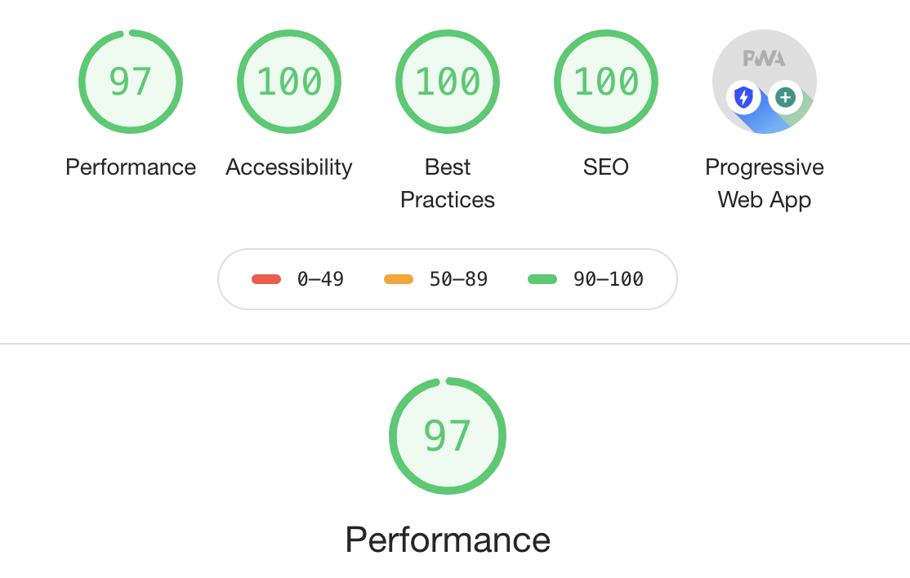

## Using React and Lighthouse to build and optimize a small PWA app

* Fetching videos from an API
* Display videos and text info using JSX in React
* Focus om mobile view
* Optimize using Lighthouse
* Tweaking lot's of things like manifest, pre-load images, maskable icon, service worker settings to achieve higher rating.

#### Tech used: 
- JavaScript
- Create react app
- serve.js
- Google Lighthouse - Chrome
- VS Code

## View it live & please run lighthouse on you own
https://pwa-build-react-and-lighthouse.netlify.app/

##
#### Almost there:
